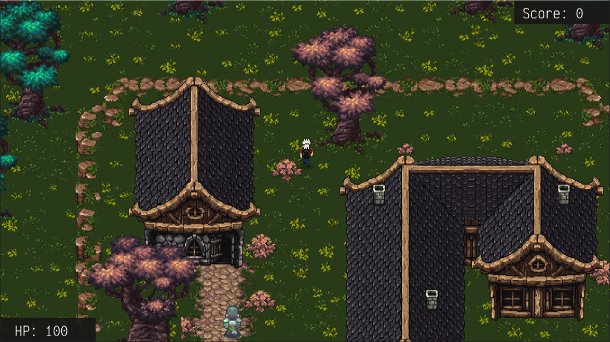

# GrimDoom

## 2D RPG Game Made with [MonoGame](https://www.monogame.net)

GrimDoom is the name of my 2D action role-playing game created using MonoGame, an open-source continuation of
Microsoft’s old XNA framework. GrimDoom is a game in which players must fight off hoards of enemies, making use of
various weapons to achieve their goal. Every enemy killed provides the player with some money, which they can use to buy
upgrades for their weapons.

I chose MonoGame as my engine of choice as it is much lower level that something like Unity3D. Pathfinding, Collisions,
Player layering, Enemy AI, and Graphical user interface components were all custom made, and designed to allow anyone to
easily add to the game.

The game itself is rather simple, it’s the backend systems that have really been the focus of my development, the game
is very easy to expand upon and add too.

## The Wiki

The game wiki is hosted on GitLab, and details getting the game up and running. It also expands upon creating and adding
your own elements to the game.
